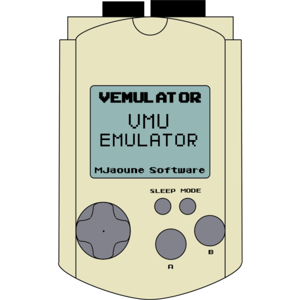

# VeMUlator

### Description

A port of the SEGA Visual Memory Unit emulator VeMUlator for libretro.

### License

GPL v3

### Icon

### Fanart

Help make me fanart!

### Screenshots

Help make me screenshots!
